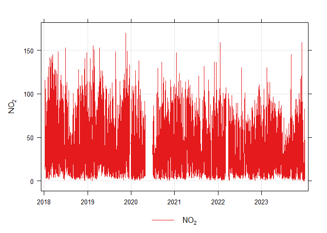

# Air Quality Trend Detection using AQEval
Chris Rushton
2025-03-05

# Setup

## Package Loading

Before we start the analysis, we need to load the required libraries.
The `AQEval` package provides functions for trend analysis and
breakpoint detection, while `openair` offers tools to import and
visualize air quality data.

``` r
library(openair)
library(ggplot2)
library(AQEval)
library(dplyr)
```


    Attaching package: 'dplyr'

    The following objects are masked from 'package:stats':

        filter, lag

    The following objects are masked from 'package:base':

        intersect, setdiff, setequal, union

``` r
library(lubridate)
```


    Attaching package: 'lubridate'

    The following objects are masked from 'package:base':

        date, intersect, setdiff, union

``` r
library(worldmet)
library(glue)
```

## Data Retrieval

We will retrieve data for a specific site (in this case, `"bdma"`) from
the AURN database. The data spans the years 2018 to 2023. Note: The
range operator (`2018:2023`) in R generates a sequence of years to
download data for multiple years at once.

``` r
data = importAURN(site = 'bdma', year = 2018:2023)
```

## Data Inspection

After downloading the data, it is good practice to inspect it. We use
`summary()` to get an overview of the data frame and `print()` to
display the first 10 rows. This helps verify that the data has been
loaded correctly and gives insight into its structure.

``` r
summary(data)
```

         site               code                date                    
     Length:52584       Length:52584       Min.   :2018-01-01 00:00:00  
     Class :character   Class :character   1st Qu.:2019-07-02 17:45:00  
     Mode  :character   Mode  :character   Median :2020-12-31 11:30:00  
                                           Mean   :2020-12-31 11:30:00  
                                           3rd Qu.:2022-07-02 05:15:00  
                                           Max.   :2023-12-31 23:00:00  
                                                                        
          nox               no2                no                ws        
     Min.   :  1.363   Min.   :  0.175   Min.   :  0.341   Min.   : 0.000  
     1st Qu.: 39.078   1st Qu.: 19.456   1st Qu.: 12.096   1st Qu.: 2.400  
     Median : 67.501   Median : 32.243   Median : 22.672   Median : 3.500  
     Mean   : 89.045   Mean   : 37.190   Mean   : 33.831   Mean   : 3.872  
     3rd Qu.:116.474   3rd Qu.: 51.208   3rd Qu.: 42.437   3rd Qu.: 5.000  
     Max.   :952.880   Max.   :169.909   Max.   :510.640   Max.   :17.300  
     NA's   :3442      NA's   :3442      NA's   :3437      NA's   :1200    
           wd           air_temp     
     Min.   :  0.0   Min.   :-7.500  
     1st Qu.:138.0   1st Qu.: 4.900  
     Median :244.1   Median : 8.600  
     Mean   :210.0   Mean   : 8.961  
     3rd Qu.:284.3   3rd Qu.:12.900  
     Max.   :360.0   Max.   :31.000  
     NA's   :1200    NA's   :1200    

``` r
print(data[1:10,])
```

    # A tibble: 10 × 9
       site         code  date                  nox   no2    no    ws    wd air_temp
       <chr>        <chr> <dttm>              <dbl> <dbl> <dbl> <dbl> <dbl>    <dbl>
     1 Bradford Ma… BDMA  2018-01-01 00:00:00    NA    NA    NA   6.5  262       4.1
     2 Bradford Ma… BDMA  2018-01-01 01:00:00    NA    NA    NA   6.7  254.      4  
     3 Bradford Ma… BDMA  2018-01-01 02:00:00    NA    NA    NA   7.2  247.      3.7
     4 Bradford Ma… BDMA  2018-01-01 03:00:00    NA    NA    NA   7    249       3.9
     5 Bradford Ma… BDMA  2018-01-01 04:00:00    NA    NA    NA   7    250.      4  
     6 Bradford Ma… BDMA  2018-01-01 05:00:00    NA    NA    NA   5.9  250.      3.9
     7 Bradford Ma… BDMA  2018-01-01 06:00:00    NA    NA    NA   5.3  249.      3.9
     8 Bradford Ma… BDMA  2018-01-01 07:00:00    NA    NA    NA   4.4  245.      3.7
     9 Bradford Ma… BDMA  2018-01-01 08:00:00    NA    NA    NA   4    241.      3.4
    10 Bradford Ma… BDMA  2018-01-01 09:00:00    NA    NA    NA   4.5  245.      4.2

# Initial Visualisations

## Time Plot

A quick visualization of the raw time series for the nitrogen dioxide
(`no2`) concentration can be produced with `timePlot()`. This helps in
understanding the overall trends and variability in the data.

``` r
time_plot = openair::timePlot(data, pollutant="no2")
```



# De-Weathering and De-Seasoning

Air quality data is often influenced by meteorological conditions and
seasonal variations. To isolate the contribution of pollutants from
these effects, we use the `isolateContribution()` function. Here, we
remove both seasonal patterns and weather-related influences (using the
background variable `"air_temp"`).

``` r
dwds = AQEval::isolateContribution(data, "no2", deseason=TRUE, deweather=TRUE, background='air_temp')
```

    no2 ~ +s(air_temp) + te(wd, ws) + s(year.day) + s(day.hour)

The `dwds` variable is a list of the de-weathered and de-seasoned values
for `no2`, so we need to add it back to the original data frame.

``` r
data[["deweatherdeseason"]] = dwds
```

We can now plot a time series again to see the difference.

``` r
time_plot_dwds = timePlot(data, pollutant="deweatherdeseason")
```


# Further Processing

Typically we prefer our data to be averaged to 8-hour intervals to
smooth out shorter term fluctuations. We can do this using the
`timeAverage()` function from `openair`.

``` r
data_8h = openair::timeAverage(data, avg.time="8 hour")
```

We can now find our break points. Breakpoint detection helps in
identifying moments when the statistical properties of the data change,
which can indicate shifts in pollution sources or the effectiveness of
control measures. We perform this analysis on the 8-hour averaged data.
The sensitivity parameter `h` determines the resolution of the
breakpoints (a lower value can capture finer details but may require
more computation time). We have set the `h` parameter to `0.3` for this
example as it is quicker to run, but we would normally evaluate this
data with `h=0.12` for 8-hour data resolution. Experiment with different
`h` parameters to see what you can find.

``` r
break_points = AQEval::findBreakPoints(data_8h, "deweatherdeseason", h=0.3)
```

## Calculating the Trends for Each Break Segment

Once breakpoints are detected, the next step is to calculate trends
across each segment using the `quantBreakSegments()` function.

``` r
quant_break_segments = AQEval::quantBreakSegments(data_8h, "deweatherdeseason", break_points)
```

    building 5 segments


    2018-01-01 to 2019-11-18 16:00:00 (686.666666666667)

    NA->41.56;NA (NA%)


    2019-11-18 16:00:00 to 2020-04-06 (139.333333333333)

    41.56->34.13;-7.425 (-17.87%)


    2020-04-06 to 2022-04-10 (734)

    34.13->37.96;3.828 (11.22%)


    2022-04-10 to 2022-05-10 16:00:00 (30.6666666666667)

    37.96->33.17;-4.789 (-12.62%)


    2022-05-10 16:00:00 to 2023-12-31 16:00:00 (600)

    33.17->32.12;-1.052 (-3.171%)

    Warning: Removed 22 rows containing missing values or values outside the scale range
    (`geom_path()`).


## Visualising the Break Points

We can customise the time range and add descriptive labels to the plots
to make them more interpretable. We now set a custom date range and add
a title and subtitle to the breakpoint detection plot
`quant_break_segments$plot`.

``` r
start_date <- as.POSIXct("2018-01-01 00:00:00", format = "%Y-%m-%d %H:%M:%S")
end_date <- as.POSIXct("2023-09-30 00:00:00", format = "%Y-%m-%d %H:%M:%S")

custom_plot <- quant_break_segments$plot + 
  labs(
    title = "Break Point Detection at BDMA",
    subtitle = "Time Average = 8h, Sensitivity (h) parameter = 0.12"
  ) + 
  scale_x_datetime(
    limits = c(start_date, end_date)
  )

custom_plot
```

    Warning: Removed 301 rows containing missing values or values outside the scale range
    (`geom_path()`).


## View The Report

It is good to visualise the trends to get an understanding of the
general direction of the data set however it is just as important to
report on the quantitative values that these methods produce. A full
report can be extracted from the results.

``` r
print(quant_break_segments$report)
```

                 s1.date1            s1.date2  s1.date.delta    s1.c0    s1.c1
    1 2018-01-01 00:00:00 2019-11-18 16:00:00 686.66667 days       NA 41.55594
    2 2019-11-18 16:00:00 2020-04-06 00:00:00 139.33333 days 41.55594 34.13056
    3 2020-04-06 00:00:00 2022-04-10 00:00:00 734.00000 days 34.13056 37.95836
    4 2022-04-10 00:00:00 2022-05-10 16:00:00  30.66667 days 37.95836 33.16978
    5 2022-05-10 16:00:00 2023-12-31 16:00:00 600.00000 days 33.16978 32.11792
      s1.c.delta s1.per.delta
    1         NA           NA
    2  -7.425381   -17.868397
    3   3.827796    11.215156
    4  -4.788582   -12.615356
    5  -1.051860    -3.171141

# Meteorological Data Using WorldMet

We may need to integrate different data sets into our analysis. One
useful package for doing this is `worldmet`. This package allows us to
access different weather sites. In this code we identify the
`bradford_met` site id and use the `worldmet::importNOAA()` function to
download it.

``` r
bradford_met = "033300-99999"
met_data = worldmet::importNOAA(code=bradford_met, year=2018:2024)
```

    Importing NOAA Data ■■■■■                             14% |  ETA: 36s

    Importing NOAA Data ■■■■■■■■■■                        29% |  ETA: 27s

    Importing NOAA Data ■■■■■■■■■■■■■■                    43% |  ETA: 21s

    Importing NOAA Data ■■■■■■■■■■■■■■■■■■                57% |  ETA: 16s

    Importing NOAA Data ■■■■■■■■■■■■■■■■■■■■■■            71% |  ETA: 11s

    Importing NOAA Data ■■■■■■■■■■■■■■■■■■■■■■■■■■■       86% |  ETA:  5s

We can use the `left_join` function to join two data frames, `data` and
`met_data` based on the content of the `by` argument. Note that the
`worldmet` and `openair` packages are designed to work nicely together
so do not need any modification, but if you have different data sets
that do not have consistently labelled columns then you may have to do
some extra steps here.

``` r
data_merged = left_join(data, met_data, by='date')
```

# Tasks

The following tasks are designed to build on the learning achieved
during this lecture and practical session, giving you the skills to
conduct this analysis on sites of your choosing.

1.  Calculate the location of the breakpoints for `nox` at the `bdma`
    site
2.  Calculate the location of the breakpoints for `nox` and `no2` at the
    `led6` site
3.  Identify a background site suitable for performing a control task
    for both the `led6` and `bdma` sites
4.  Show the impact of fine tuning the `h` parameter for the `no2`
    concentration analysis
